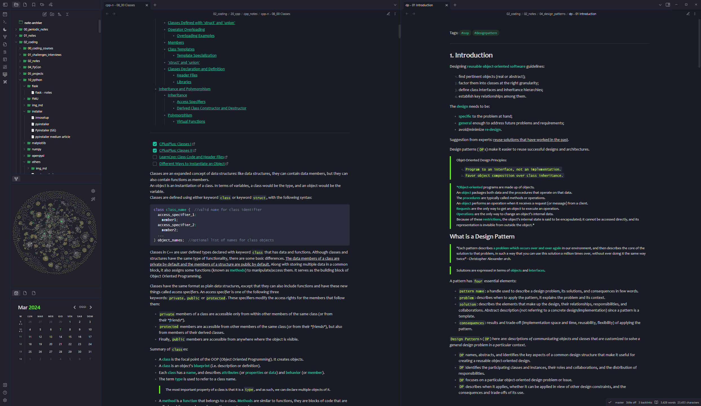
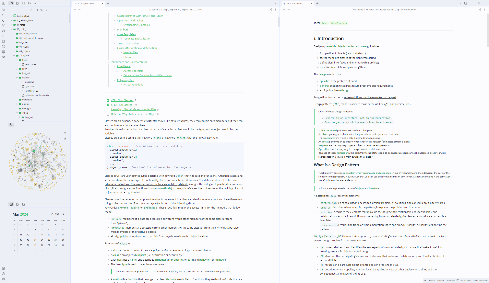

# Readme

`Soloing` is a dark and light theme with highly functional colors for note taking. 

# Installation

To install the theme

- Open Obsidian Settings
- Go to `Appearance` and click `Manage`
- Under community themes search for "Sparling Night" and click `Use`

Enjoy!✨

---

[GitHub Link](https://github.com/isax785/obsidian-soloing)

